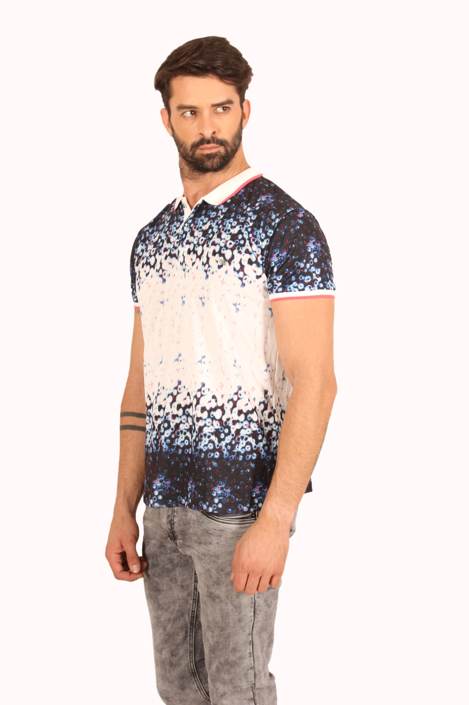

# Remove Background From an Image
Initially, I used Mask RCNN for the segmentation purpose, but its output is not the ideal one, as some background pixels were classified as foreground. So to solve this I used grabcut algorithm on top of it and used mask returned by Mask RCNN as a seed to it, I didn't input the 'on a mask' with pixel value '1', I made the 'on a mask' pixel value '3' which is the probable foreground, if I didn't do this step, then grabcut might return the same mask as of mask can. I also used the corresponding box returned by Mask RCNN as an ROI rectangle for grabcut.

### Input Image

### Ouput Image (after using mask-rcnn and grabcut for post-processing)

You can also see the alpha matted imaged in the alpha folder

#### Author   - Shubham Bindal
#### Email-id - shubhambindal610@gmail.com (you may contact for any query) 
